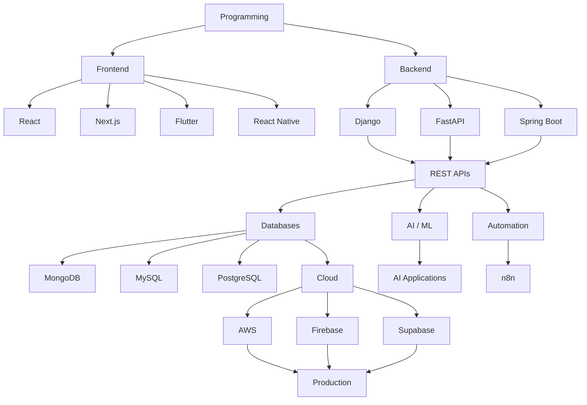

# ⚫ Rahul — Developer Dashboard

<p align="center">
  
</p>

<p align="center">
  
</p>

<p align="center">
  <a href="https://github.com/codeofrealm">
    
  </a>
  <a href="https://github.com/codeofrealm?tab=repositories">
    
  </a>
  
</p>

---

# 🧠 About Me

<table>
<tr>
<td width="60%" valign="top">

### 👋 Hello, I'm Rahul

I'm a **Full Stack Developer** focused on building practical and scalable applications across **Web, Mobile, Backend, AI/ML, Automation and Cloud**.

I enjoy turning ideas into working products with clean interfaces, structured APIs and reliable backend systems.

### 🚀 What I Work With

* 🌐 Modern Web Applications
* 📱 Cross-Platform Mobile Applications
* ⚙️ Backend & REST API Development
* 🤖 AI / ML Applications
* 🔄 Workflow Automation
* ☁️ Cloud & Backend Services
* 🧪 Manual & Automation Testing
* 🎮 Game & 3D Development

</td>

<td width="40%" valign="top">

```text
╔══════════════════════════════╗
║       DEVELOPER PROFILE      ║
╠══════════════════════════════╣
║                              ║
║  WEB          ██████████     ║
║  MOBILE       █████████      ║
║  BACKEND      █████████      ║
║  AI / ML      ████████       ║
║  CLOUD        ███████        ║
║  AUTOMATION   ███████        ║
║  TESTING      ███████        ║
║  GAME DEV     ██████         ║
║                              ║
╚══════════════════════════════╝
```

</td>
</tr>
</table>

---

# 🖥️ Skills & Technology

## 🌐 Frontend Development

<p>

</p>

`React` `Next.js` `Flutter` `React Native`

---

## ⚙️ Backend Development

<p>

</p>

`Django` `FastAPI` `Spring Boot`

---

## 💻 Programming Languages

<p>

</p>

`Python` `Java` `JavaScript` `TypeScript`

---

## 🗄️ Databases

<p>

</p>

`MongoDB` `MySQL` `PostgreSQL`

---

## 🤖 AI / ML

```text
┌─────────────────────────────────────┐
│             AI / ML                 │
├─────────────────────────────────────┤
│                                     │
│  🧠 ML Training                     │
│  🤖 AI Applications                 │
│                                     │
└─────────────────────────────────────┘
```

`ML Training` `AI Applications`

---

## ☁️ Cloud

<p>

</p>

`AWS` `Firebase` `Supabase`

---

## 🔄 Automation

```text
┌─────────────────────────────────────┐
│            AUTOMATION               │
├─────────────────────────────────────┤
│                                     │
│  🔄 n8n                             │
│  ⚙️ Automation Testing              │
│                                     │
└─────────────────────────────────────┘
```

`n8n` `Automation Testing`

---

## 🎮 Game Development

<p>

</p>

`Blender` `Godot Engine`

---

## 🧪 Testing

```text
┌─────────────────────────────────────┐
│              TESTING                │
├─────────────────────────────────────┤
│                                     │
│  🔍 Manual Testing                  │
│  ⚙️ Automation Testing              │
│                                     │
└─────────────────────────────────────┘
```

`Manual Testing` `Automation Testing`


# 🚀 Featured Projects

<table>
<tr>

<td width="50%" valign="top">

## 💼 Employee Track AI

**Full Stack Management Platform**

`React` `Django` `PostgreSQL` `AI`

Employee-focused application for managing organizational workflows and data.

</td>

<td width="50%" valign="top">

## 🤖 AI Applications

**AI-Powered Applications**

`Python` `AI/ML` `Flutter`

Applications focused on integrating AI capabilities into practical user workflows.

</td>

</tr>

<tr>

<td width="50%" valign="top">

## 📱 Mobile Applications

**Cross-Platform Apps**

# 🧊 3D Development

<p align="center">
  
</p>

<p align="center">

### 🎮 Blender • Godot Engine

</p>

<p align="center">

I'm exploring **3D modeling, interactive environments and game development** using Blender and Godot Engine.

</p>

<table align="center">
<tr>
<td align="center" width="33%">

### 🧊 3D Modeling

Blender

</td>

<td align="center" width="33%">

### 🎮 Game Engine

Godot Engine

</td>

<td align="center" width="33%">

### 🌌 Interactive

3D Experiences

</td>
</tr>
</table>

---

## 🖥️ 3D Model Showcase

<p align="center">


</p>

<p align="center">

### 🎮 Interactive 3D Project

**Blender → Godot Engine → Interactive Experience**

</p>

<p align="center">

<a href="YOUR_3D_MODEL_LINK">
  
</a>

<a href="YOUR_3D_MODEL_DOWNLOAD_LINK">
  
</a>

</p>

`Flutter` `React Native`

Mobile applications designed for modern Android and cross-platform experiences.

</td>

<td width="50%" valign="top">

## 🌐 Web Applications

**Modern Web Systems**

`React` `Next.js` `Django` `FastAPI`

Responsive web applications with structured frontend and backend architecture.

</td>

</tr>

<tr>

<td width="50%" valign="top">

## 🔄 Automation Systems

**Workflow Automation**

`n8n` `Python` `Automation Testing`

Automation workflows designed to reduce repetitive development and testing tasks.

</td>

<td width="50%" valign="top">

## 🎮 3D / Game Development

**Interactive Experiences**

`Blender` `Godot Engine`

Exploring 3D design, interactive experiences and game development.

</td>

</tr>
</table>

---

# 🏗️ Development Architecture

```text
                    ┌─────────────────┐
                    │      IDEA       │
                    └────────┬────────┘
                             │
                             ▼
                    ┌─────────────────┐
                    │      UI/UX      │
                    └────────┬────────┘
                             │
                             ▼
              ┌────────────────────────────┐
              │         FRONTEND           │
              │ React • Next • Flutter     │
              │ React Native               │
              └─────────────┬──────────────┘
                            │
                            ▼
              ┌────────────────────────────┐
              │          API               │
              │ Django • FastAPI           │
              │ Spring Boot                │
              └─────────────┬──────────────┘
                            │
                            ▼
              ┌────────────────────────────┐
              │         DATABASE           │
              │ MongoDB • MySQL            │
              │ PostgreSQL                 │
              └─────────────┬──────────────┘
                            │
                            ▼
              ┌────────────────────────────┐
              │       AI / AUTOMATION      │
              │ ML • AI • n8n               │
              └─────────────┬──────────────┘
                            │
                            ▼
              ┌────────────────────────────┐
              │          CLOUD             │
              │ AWS • Firebase • Supabase  │
              └─────────────┬──────────────┘
                            │
                            ▼
                    ┌─────────────────┐
                    │    DEPLOY 🚀    │
                    └─────────────────┘
```

---

# 🧪 Development Workflow

```text
        ┌──────────────┐
        │     PLAN     │
        └──────┬───────┘
               ↓
        ┌──────────────┐
        │    DESIGN    │
        └──────┬───────┘
               ↓
        ┌──────────────┐
        │     CODE     │
        └──────┬───────┘
               ↓
        ┌──────────────┐
        │     TEST     │
        └──────┬───────┘
               ↓
        ┌──────────────┐
        │   AUTOMATE   │
        └──────┬───────┘
               ↓
        ┌──────────────┐
        │    DEPLOY    │
        └──────┬───────┘
               ↓
        ┌──────────────┐
        │    IMPROVE   │
        └──────────────┘
```

---

# 🗺️ Learning & Development Roadmap



---

# 📚 Current Learning Areas

| Area                | Focus                                |
| ------------------- | ------------------------------------ |
| 🌐 Frontend         | React, Next.js                       |
| 📱 Mobile           | Flutter, React Native                |
| ⚙️ Backend          | Django, FastAPI, Spring Boot         |
| 💻 Programming      | Python, Java, JavaScript, TypeScript |
| 🗄️ Database        | MongoDB, MySQL, PostgreSQL           |
| 🤖 AI / ML          | ML Training, AI Applications         |
| ☁️ Cloud            | AWS, Firebase, Supabase              |
| 🔄 Automation       | n8n, Automation Testing              |
| 🎮 Game Development | Blender, Godot Engine                |
| 🧪 Testing          | Manual & Automation Testing          |

---

# 📦 Technology Matrix

| Category         | Technologies                             |
| ---------------- | ---------------------------------------- |
| Frontend         | React • Next.js • Flutter • React Native |
| Backend          | Django • FastAPI • Spring Boot           |
| Programming      | Python • Java • JavaScript • TypeScript  |
| Databases        | MongoDB • MySQL • PostgreSQL             |
| AI / ML          | ML Training • AI Applications            |
| Cloud            | AWS • Firebase • Supabase                |
| Automation       | n8n • Automation Testing                 |
| Game Development | Blender • Godot Engine                   |
| Testing          | Manual Testing • Automation Testing      |

---

# 🎯 Developer Focus

```text
╔══════════════════════════════════════════════╗
║              CURRENT FOCUS                   ║
╠══════════════════════════════════════════════╣
║                                              ║
║  ████████████████████  Full Stack           ║
║  ██████████████████░░  Web Development      ║
║  █████████████████░░░  Mobile Development   ║
║  ████████████████░░░░  Backend APIs         ║
║  ██████████████░░░░░░  AI / ML              ║
║  █████████████░░░░░░░  Cloud                ║
║  ████████████░░░░░░░░  Automation           ║
║  ███████████░░░░░░░░░  Testing              ║
║  ██████████░░░░░░░░░░  Game Development     ║
║                                              ║
╚══════════════════════════════════════════════╝
```

---

# ⚡ Developer Philosophy

<p align="center">

```text
BUILD
  ↓
TEST
  ↓
BREAK
  ↓
FIX
  ↓
LEARN
  ↓
AUTOMATE
  ↓
DEPLOY
  ↓
REPEAT
```

### "Build. Break. Learn. Repeat."

</p>

---

# 🌐 GitHub

<p align="center">

<a href="https://github.com/codeofrealm">
  
</a>

<a href="https://github.com/codeofrealm?tab=repositories">
  
</a>

</p>

---

# 👀 Profile Views

<p align="center">
  
</p>

---

<p align="center">


## ⚫ ZERONEX

### Developer • Builder • Learner • Creator

**Thanks for visiting my GitHub profile.**

</p>

<p align="center">
  <sub>© Rahul • Built with code, curiosity and consistency.</sub>
</p>
