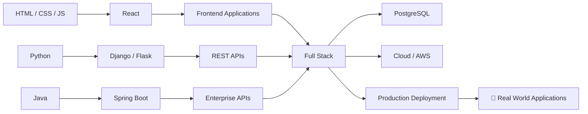

# 🌌 Rahul — Full Stack Developer

<p align="center">
  
</p>

<p align="center">
  
</p>

<p align="center">
  <a href="https://github.com/codeofrealm">
    
  </a>
  <a href="https://github.com/codeofrealm?tab=repositories">
    
  </a>
  
</p>

---

## 🧠 About Me

```text
┌──────────────────────────────────────────────────────────────┐
│                         RAHUL                                │
├──────────────────────────────────────────────────────────────┤
│ 💻 Full Stack Developer                                      │
│ 📱 Flutter & Mobile Application Builder                      │
│ 🌐 React Web Application Developer                           │
│ ⚙️ Django / Flask / Spring Boot Backend                      │
│ 🗄️ PostgreSQL / MySQL / MongoDB                             │
│ ☁️ AWS & Deployment                                          │
│ 📘 DSA Practice                                              │
│ 🚀 Always learning new technologies                          │
└──────────────────────────────────────────────────────────────┘
```

I build practical applications across **Web, Mobile, Backend, APIs and Cloud**.

My focus is on creating applications with:

* ⚡ Clean and responsive UI
* 🔐 Secure and structured APIs
* 🧩 Scalable backend architecture
* 🗄️ Reliable database design
* 📱 Cross-platform mobile applications
* ☁️ Deployment-ready applications

---

# 🧩 Technology Universe

## 👨‍💻 Programming

<p>

</p>

`JavaScript` `Python` `Java`

---

## 🌐 Frontend

<p>

</p>

`HTML` `CSS` `Tailwind CSS` `React.js`

---

## ⚙️ Backend

<p>

</p>

`Django` `Flask` `Spring Boot`

---

## 📱 Mobile Development

<p>

</p>

`Flutter` `Android Studio`

---

## 🗄️ Databases

<p>

</p>

`MongoDB` `MySQL` `PostgreSQL` `Firebase`

---

## ☁️ DevOps & Tools

<p>

</p>

`Git` `GitHub` `VS Code` `AWS` `Postman` `PowerShell`

---

# 🚀 Full Tech Stack

<p align="center">
  
</p>

---

# 📊 GitHub Analytics

<p align="center">
  
  
</p>

---

# 🔥 Contribution Streak

<p align="center">
  
</p>

---

# 📈 Contribution Activity

<p align="center">
  
</p>

---

# 🏆 GitHub Achievements

<p align="center">
  
</p>

---

# 🚀 Featured Projects

<table>
<tr>
<td width="50%">

### 💰 Loan Web Application

**Stack**

`React` `Firebase`

Dashboard-oriented web application designed for managing loan-related workflows and information.

</td>

<td width="50%">

### 🤖 AI Chat Application

**Stack**

`Flutter` `AI`

Mobile application focused on conversational interaction with voice and AI capabilities.

</td>
</tr>

<tr>
<td width="50%">

### 💸 Expense Tracker

**Stack**

`Flutter`

Mobile application for tracking expenses and monitoring monthly spending.

</td>

<td width="50%">

### 👨‍💼 Employee Management

**Stack**

`React` `Django` `PostgreSQL`

Management-focused application for handling employee-related data and workflows.

</td>
</tr>
</table>

---

# 🧪 Current Focus

```text
Frontend       ████████████████████░░   React / Tailwind
Backend        ███████████████████░░░   Django / Spring Boot
Mobile         ██████████████████░░░░   Flutter
Database       ███████████████████░░░   PostgreSQL / MySQL
Cloud          ███████████████░░░░░░░   AWS
DSA            ███████████████░░░░░░░   Practice
```

---

# 🗺️ Developer Roadmap



---

# 📱 Development Areas

| Area               | Technologies                         |
| ------------------ | ------------------------------------ |
| 🌐 Web             | React, HTML, CSS, Tailwind           |
| ⚙️ Backend         | Django, Flask, Spring Boot           |
| 📱 Mobile          | Flutter, Android                     |
| 🗄️ Database       | PostgreSQL, MySQL, MongoDB, Firebase |
| 🔌 API             | REST APIs, Postman                   |
| ☁️ Cloud           | AWS                                  |
| 🛠️ Development    | Git, GitHub, VS Code                 |
| 📘 Problem Solving | DSA                                  |

---

# 🎯 What I'm Building

```text
┌──────────────────────┐
│       IDEAS          │
└──────────┬───────────┘
           ↓
┌──────────────────────┐
│      DESIGN          │
└──────────┬───────────┘
           ↓
┌──────────────────────┐
│       CODE           │
└──────────┬───────────┘
           ↓
┌──────────────────────┐
│        API           │
└──────────┬───────────┘
           ↓
┌──────────────────────┐
│      DATABASE        │
└──────────┬───────────┘
           ↓
┌──────────────────────┐
│      DEPLOY          │
└──────────┬───────────┘
           ↓
┌──────────────────────┐
│   REAL APPLICATION   │
└──────────────────────┘
```

---

# 📚 Learning

* 🧠 Data Structures & Algorithms
* ⚛️ Advanced React
* 🐍 Django REST APIs
* ☕ Spring Boot
* 📱 Flutter Application Development
* 🐘 PostgreSQL
* ☁️ AWS & Deployment
* 🔐 API Security
* 🏗️ Scalable Application Architecture

---

# ⚡ Developer Philosophy

<p align="center">

### BUILD → TEST → BREAK → FIX → LEARN → REPEAT

</p>

> **“Build. Break. Learn. Repeat.”**

---

# 🌐 Connect With Me

<p align="center">

<a href="https://github.com/codeofrealm">

</a>

<a href="https://github.com/codeofrealm?tab=repositories">

</a>

</p>

---

<p align="center">


### 🌌 ZERONEX

**Developer • Builder • Learner • Creator**

⭐ Thanks for visiting my GitHub profile!

</p>
