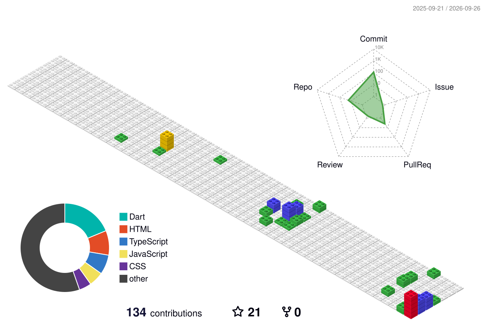

<h1 align="center">
  
</h1>

  

  
  
  

  
  

---

## 🙏 Namaste

I'm **Rahul**, an enthusiast developer building across web, mobile, and AI 🇮🇳

Technology has always fascinated me — I've immersed myself in full-stack development, applied ML, and generative 3D. My purpose? **Building things that actually get used.**

I'm a curious person who loves prototyping fast — idea to working demo, then straight to my 3D printer.

I'm passionate about:
- 🌐 Web & Mobile Development
- 🤖 Artificial Intelligence & Machine Learning
- 🖨️ 3D Modeling, Generative 3D & Printing

### 📍 Present Status
- 👉 Building projects across Java / Python / TypeScript stacks
- 👉 Training and fine-tuning models with PyTorch & Transformers
- 👉 Generating and printing 3D assets end-to-end (prompt → mesh → print)
- 👉 Always open to collaborating on open-source

---

## 📊 GitHub Activity

  

  

---

## 🧩 Mastered Technologies & Topics

**Programming Languages**

  

**Frameworks & Libraries**

  

**Artificial Intelligence & Machine Learning**

  

  
  
  

**3D Modeling & Printing**

  

  
  
  
  
  
  

<b>3D pipeline — role of each tool</b>

 

| Tool | Role in my workflow |
|---|---|
| **Bambu Lab A1** | FDM printer used for final prototyping and physical prints of generated models |
| **Blender** | Manual sculpting, retopology, UV work, and cleanup before slicing |
| **Large Gaussian Model (LGM)** | Fast image-to-3D generation using Gaussian splatting, converted to mesh for editing |
| **PyMeshLab** | Scripted mesh repair, decimation, and format conversion in Python pipelines |
| **CSM** | AI-assisted 3D asset generation from text/image prompts |
| **Tripo3D** | Rapid text/image-to-3D generation for early-stage concept models |
| **Meshy.ai** | Texturing and refinement of generated meshes before print prep |

---

## 📈 GitHub Stats

  
  

  

<b>🏆 GitHub Trophies</b>

 

  

  

