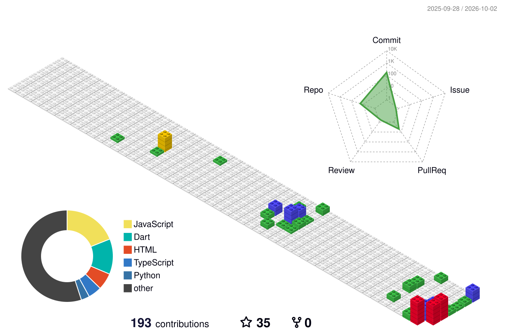

<h1 align="center">
  
</h1>

<p align="center">
  
</p>

<p align="center">
  
</p>

<p align="center">
<a href="#"></a>
<a href="#"></a>
<a href="#"></a>
</p>

<p align="center">


</p>

---

## 👨‍💻 About Me

I'm **cybrninjaX**, an enthusiast developer building across web, mobile, AI, and 3D 🇮🇳

Technology has always fascinated me — I've immersed myself in full-stack development, applied machine learning, generative 3D, automation, and software experimentation.

My purpose?

> **Building things that actually get used.**

I'm a curious developer who loves prototyping fast — from an initial idea to a working demo, and sometimes all the way to a physical 3D print.

### 🚀 What I'm Passionate About

* 🌐 Web & Mobile Development
* 🤖 Artificial Intelligence & Machine Learning
* 🧠 LLMs & Applied AI
* ⚙️ Automation & Developer Tools
* 🖨️ 3D Modeling, Generative 3D & Printing
* ☁️ Cloud Development & Deployment
* 🧪 Software Testing & Automation

---

## 📍 Present Status

* 👉 Building projects across **Java / Python / TypeScript** stacks
* 👉 Developing full-stack applications with modern frameworks
* 👉 Training and fine-tuning models with **PyTorch & Transformers**
* 👉 Experimenting with AI applications and LLM workflows
* 👉 Generating and printing 3D assets end-to-end
* 👉 Exploring automation using Python and n8n
* 👉 Working with cloud platforms and modern deployment workflows
* 👉 Always open to collaborating on interesting open-source projects

---

## 📊 GitHub Activity

<p align="center">
  
</p>

<p align="center">
  
</p>

---

# 🧩 Mastered Technologies & Topics

## 💻 Programming Languages

<p align="center">


</p>

---

## ⚛️ Frameworks & Libraries

<p align="center">


<picture><source media="(prefers-color-scheme: dark)" srcset="https://cdn.simpleicons.org/nextdotjs/FFFFFF"></picture>


<picture><source media="(prefers-color-scheme: dark)" srcset="https://cdn.simpleicons.org/flask/FFFFFF"></picture>

</p>

---

## 🤖 Artificial Intelligence & Machine Learning

<p align="center">


</p>

---

## 🗄️ Databases

<p align="center">


</p>

---

## ☁️ Cloud & Backend Services

<p align="center">


</p>

---

## ⚙️ Automation & Testing

<p align="center">


</p>

---

## 🖨️ 3D Modeling & Printing

<p align="center">


</p>

<details>
<summary><b>🧱 3D Pipeline — Role of Each Tool</b></summary>

<br>

| Tool                           | Role in my workflow                                                                 |
| ------------------------------ | ----------------------------------------------------------------------------------- |
| **Bambu Lab A1**               | FDM printer used for final prototyping and physical prints of generated models      |
| **Blender**                    | Manual sculpting, retopology, UV work, and cleanup before slicing                   |
| **Large Gaussian Model (LGM)** | Fast image-to-3D generation using Gaussian splatting, converted to mesh for editing |
| **PyMeshLab**                  | Scripted mesh repair, decimation, and format conversion in Python pipelines         |
| **CSM**                        | AI-assisted 3D asset generation from text/image prompts                             |
| **Tripo3D**                    | Rapid text/image-to-3D generation for early-stage concept models                    |
| **Meshy.ai**                   | Texturing and refinement of generated meshes before print preparation               |

</details>

---

## 🛠️ Tools & Development Environment

<p align="center">

<picture><source media="(prefers-color-scheme: dark)" srcset="https://cdn.simpleicons.org/github/FFFFFF"></picture>


</p>

---

## 🔄 How I Build

<p align="center">


</p>

```text
                         ┌─────────────┐
                         │    IDEA     │
                         └──────┬──────┘
                                │
                                ▼
                      ┌──────────────────┐
                      │    PROTOTYPE     │
                      └────────┬─────────┘
                               │
                               ▼
                     ┌────────────────────┐
                     │       BUILD        │
                     └─────────┬──────────┘
                               │
                               ▼
                      ┌──────────────────┐
                      │       TEST       │
                      └────────┬─────────┘
                               │
                               ▼
                     ┌────────────────────┐
                     │      DEPLOY        │
                     └────────────────────┘
```

---

## 📈 GitHub Stats

<p align="center">


</p>

<p align="center">


</p>

<p align="center">


</p>

---

## 🏆 GitHub Achievements

<p align="center">


</p>

---

## 🌑 Current Mindset

<p align="center">


</p>

---

## 🤝 Open Source & Collaboration

I'm always interested in collaborating on:

* 🤖 AI / ML applications
* 🌐 Full-stack applications
* 📱 Mobile applications
* ⚙️ Developer automation tools
* 🧪 Testing and QA automation
* 🖨️ Generative 3D projects
* 🧩 Open-source developer tools

If you're building something interesting, feel free to connect.

---

<p align="center">


</p>

<p align="center">
  <sub>© cybrninjaX • Built with code, curiosity, and caffeine.</sub>
</p>
